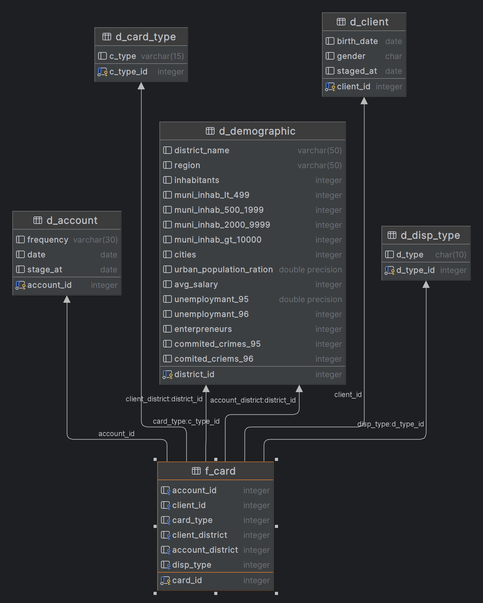
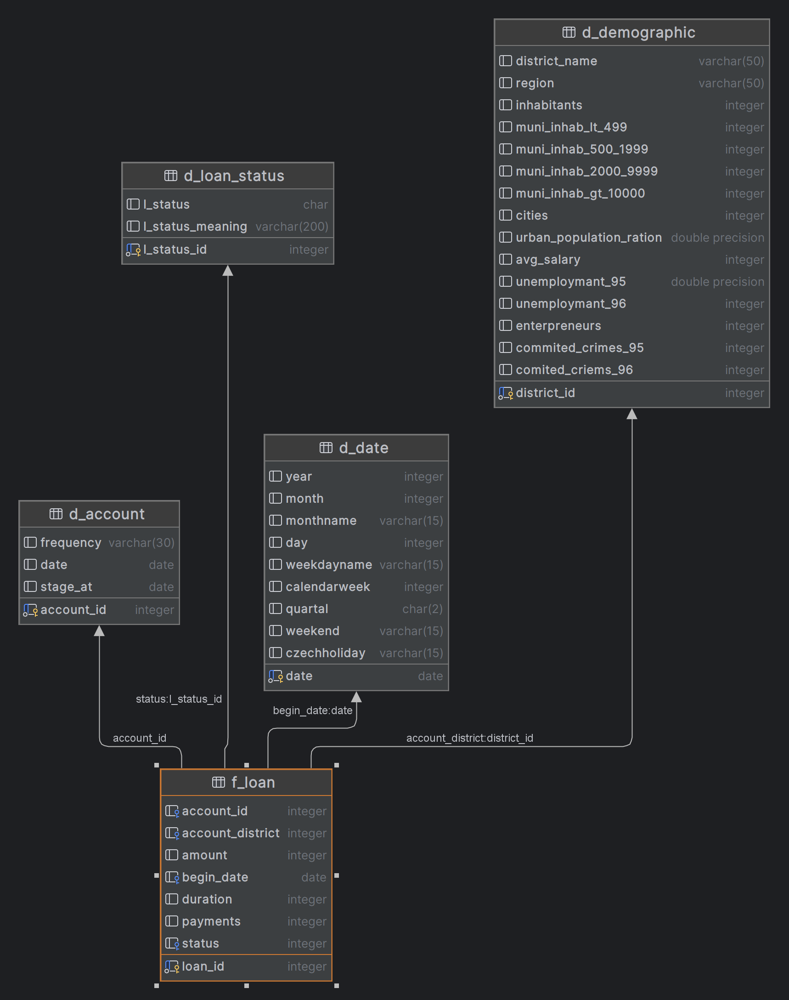
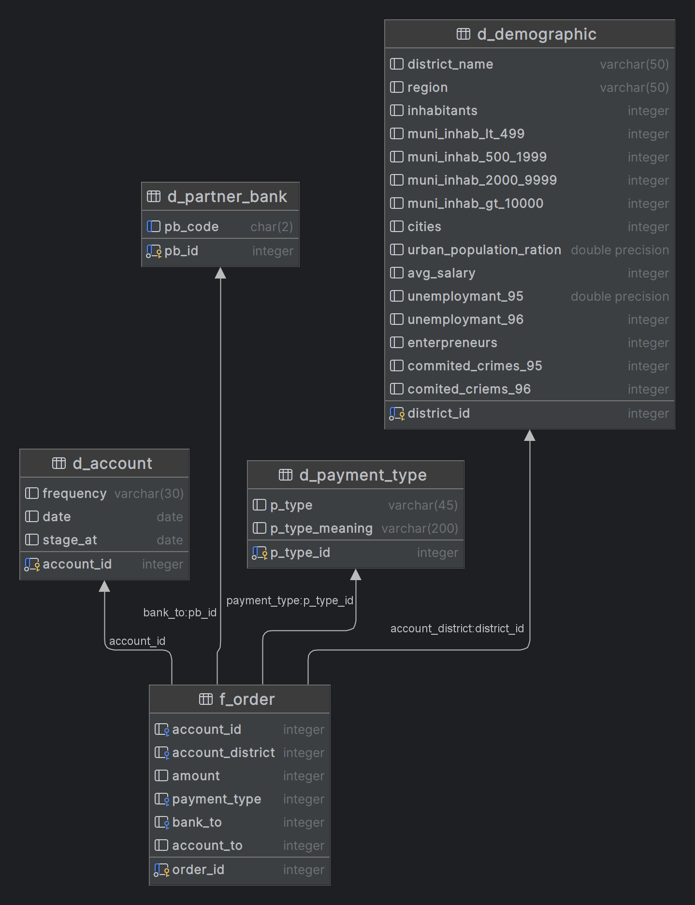
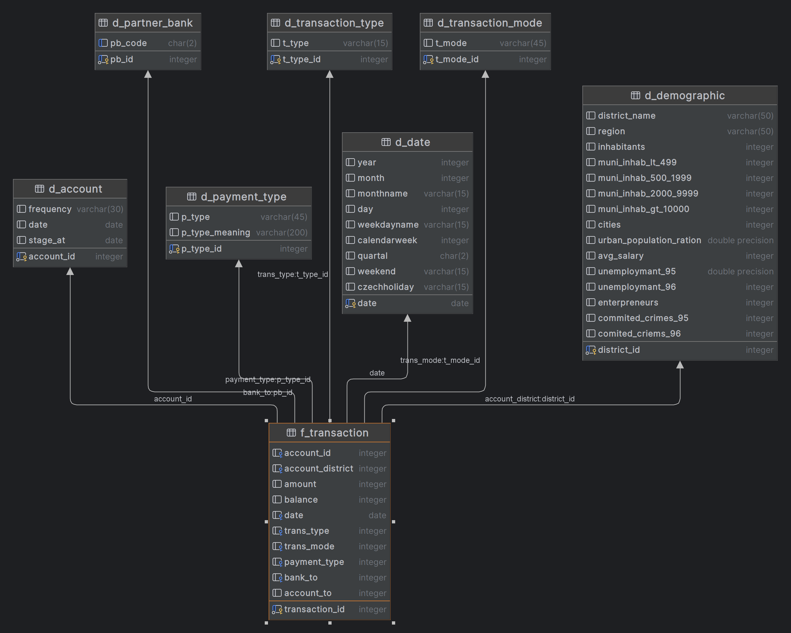

# dwbif-project
Project for the Data Warehouse &amp; Business Intelligence Fundamentals course, taught at FMI, Sofia University

1 Database : dw
3 Schemas : business_op, staging_area, data_warehouse

# Staging
- На редовно обновяваните неща се добавя дата, ако има промяна с данните в склада, ще се добавят в склада с новата дата?
- Където по принцип си има дата, се сменя от формат `INТ` на `DATE`
- За `Client`: От `birth number` се извлича пола и се добавя като нов атрибут в таблицата, пък числото се възстановява като истинска дата и се слага във формат `DATE`
# DWH

## Dimensions
### Account
- премахваме зависимостта към d_demographic, защото искаме star schema, няма нужда от такива зависимости. Където се ползва акаунт като дименсия, ще имаме връзка и към дименсията d_demographic, като account_district.

### Card Type

### Characterization

### Client
- премахваме зависимостта към d_demographic, защото искаме star schema, няма нужда от такива зависимости. Където се ползва акаунт като дименсия, ще имаме връзка и към дименсията d_demographic, като client_district.

### Date
Генерирано според [Date & Time Dimensions: PostgreSQL Wiki](https://wiki.postgresql.org/wiki/Date_and_Time_dimensions), като са оставени само най-основните полета. Тъй като данните се отнасят за периода 93-96 година, в таблицата са генерирани датите от 01-01-93 до 12-31-96, но периодът лесно може да бъде удължен.

### Demographic

### Partner Bank
Казано е, че всяка има двубуквен код. В отделна дименсия, тъй като е качествена/описателна стойност, а може и впоследствие клиентът да реши освен двубуквения код да пази и цялото име - има място за разширяване.

### Transaction Mode

### Transaction Type

## Fact Tables
### f_card

### f_loan

### f_order

### f_transaction

